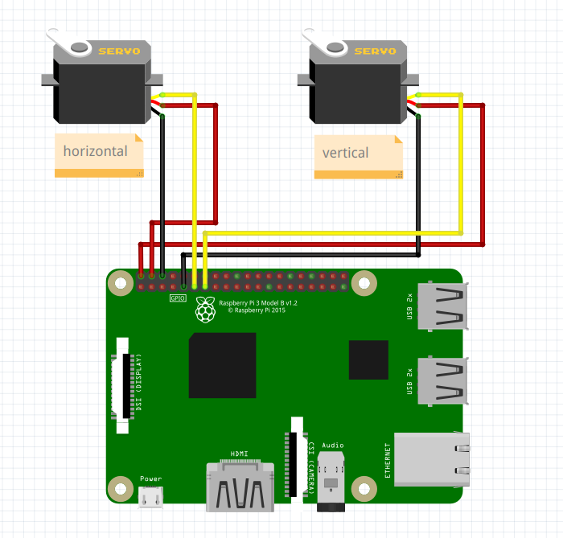

# Remote camera control
This project offers remote control of a rotatory camera device through a browser. There is an option menu that allows you to control settings directly via your browser and configurable ways to control camera movements.

## Setting up from a disk image
0)  This project has been tested on Raspberry Pi 3 and 4, but it should also work on Raspberry Zero (however not yet tested)
1)  Connect your servos to pins 17 and 27 using this diagram. If you decide to connect to different pins, you can always change that in a configuration file.  
  
Diagram made with [fritzing](https://github.com/fritzing/fritzing-app)
2)  Flash your micro SD card with an image in the releases tab. It is pretty heavily compressed

3)  After flashing micro SD card with OS, plug it in your PC and open partition boot.
There you have to create a network configuration file named `wpa_supplicant.conf` and fill it with this template
```text
ctrl_interface=DIR=/var/run/wpa_supplicant GROUP=netdev
update_config=1
country=RU

network={
        ssid="name"
        psk="password"
}
```
It is also recommended to turn on **System Options** >> **Network at Boot** in `sudo raspi-config`.
That way your OS starts only when network has been connected. (however it works even with it off)

4)  Then eject card and boot raspberry

## Configuring repository manually (not from an image)
1)  Copy `example_config.py` as `config.py` (config.py is in .gitignore and example_config.py is a template).
Then editing that file you can change settings.
